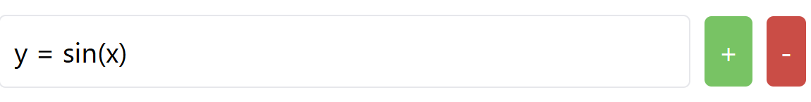

## Cloud Computing Final Project - StormCloud 

### Project Title: Graphulator 

### Group Members 
- Shuhao Yu 
- Luke Haidze 
- Sam Brunacini 
- Kevin Burkhardt 
- Na Tang 
  
### Project Description

Our project will consist of creating an online web application that can graph a given function and provide other tools for calculating different statistics/values, such as the derivative and integral. Our application will be enabled through the use of a cloud service that provides all the necessary resources for our project to run. 

### Project Structure

Project Name: Graphulator 

#### Frontend

https://graphulator-app-598507763983.us-central1.run.app/

Technologies/Languages
- Javascript 
- HTML 
- CSS 
- Python 
- UI/UX 
- Left-bar - Function Input
- Top-half – Graph Download and Cloud Load
- Bottom-half – Derivative and Integral Calculation 
- Home Page - Provides help section, access to previous graphs, or creating a new graph 
- Calculator Page - Allows basic scientific calculator functionality 

Button Functions
- Green/Red Button - Add New Function/Delete This Function


- Download PNG - Download the Graph as PNG


- Load GraphData - Access Record of Recent User 


#### Backend

Database and APIs 

GCP Technologies
- Cloud Storage - Store the static files 
- Cloud Run - Responsible for the backend server part
  - Provide APIs
  - Handle the static files from cloud Storage and return to frontend
  - Connect with cloud function 
- Cloud Function - Responsible for processing and acquiring graph data
- Firestore - Store the graph data when generate new graphs

Deploy with Automation
- GitHub Actions 

### Github Actions Command Guidance

(1) When the HTML file is changed and only the HTML file needs to be deployed, the git commit message including "[cloudstorage]" will automatically trigger the Cloud Storage deployment task, such as: 

```bash 
git commit -m "update html [cloudstorage]"
```

(2) Similarly, when the commit message includes "[cloudrun]", will only the server part be deployed to Cloud Run, such as: 

```bash 
git commit -m "update server [cloudrun]"
```

(3) When the commit message contains both like "[cloudstorage][cloudrun]", two deploy tasks will be triggered to execute in parallel,  such as: 

```bash 
git commit -m "update [cloudstorage][cloudrun]"
```

(4) When neither is included, it will only be committed and will not trigger the GitHub action's automatic deployment, such as: 

```bash 
git commit -m "update" 
```

